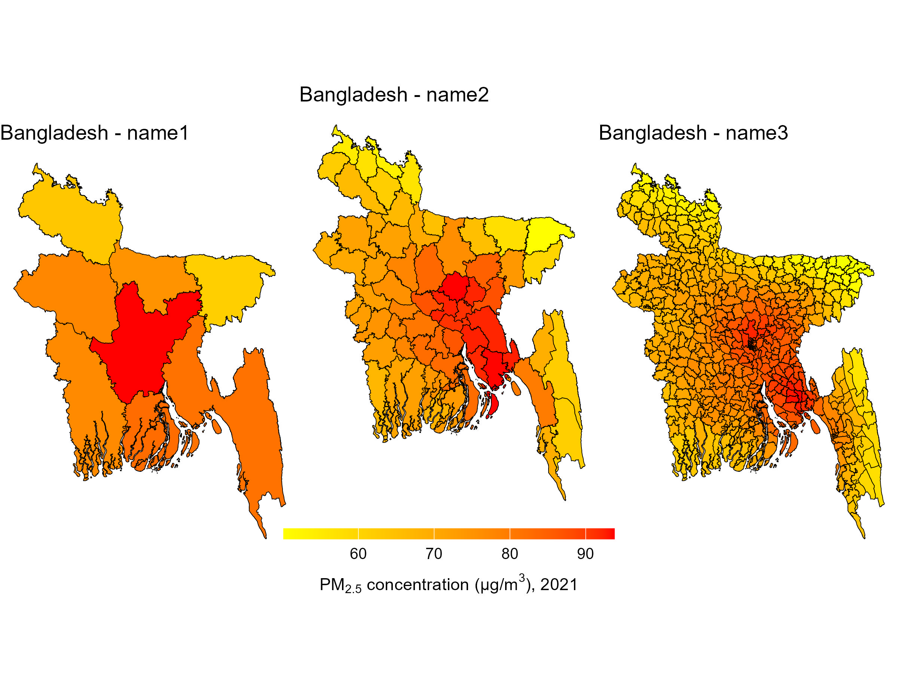
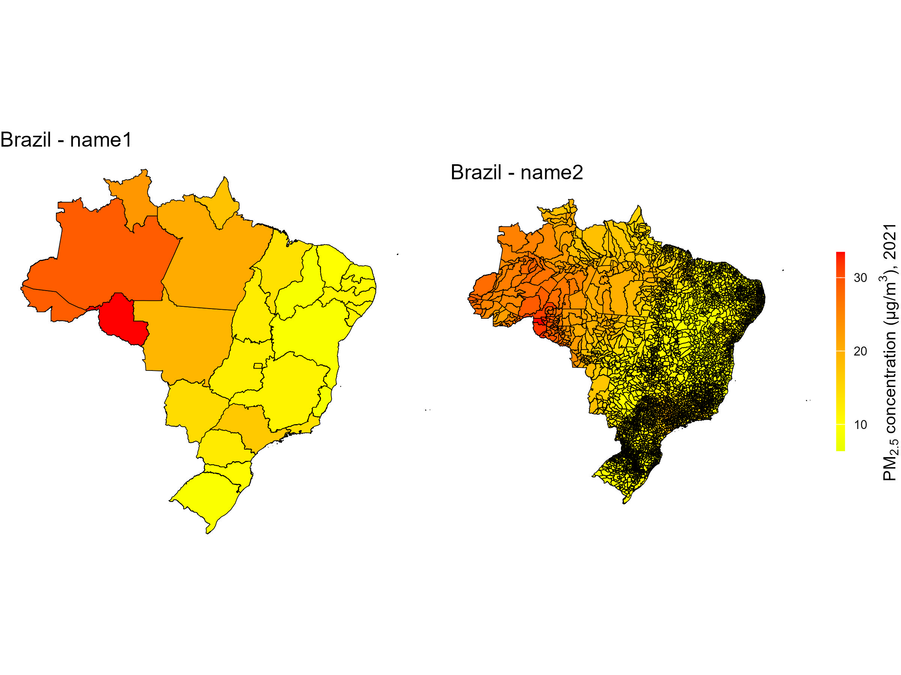
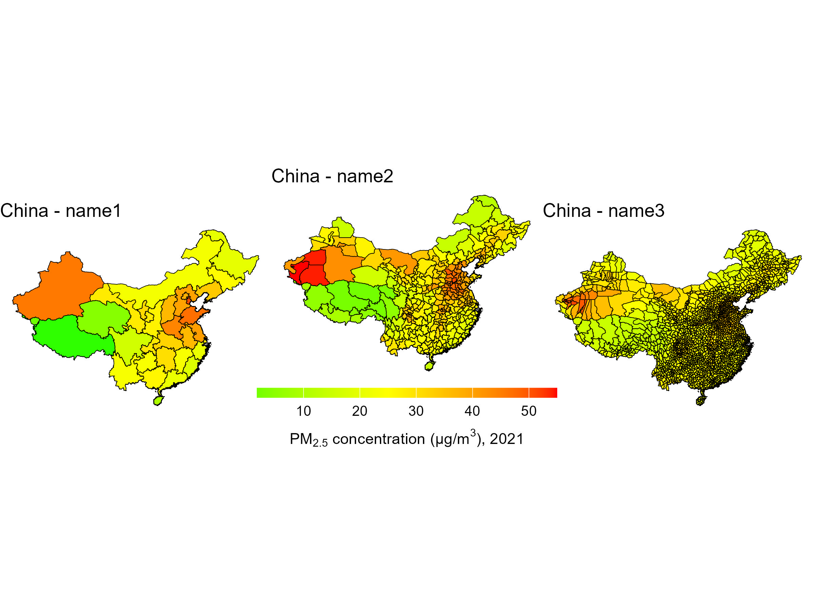
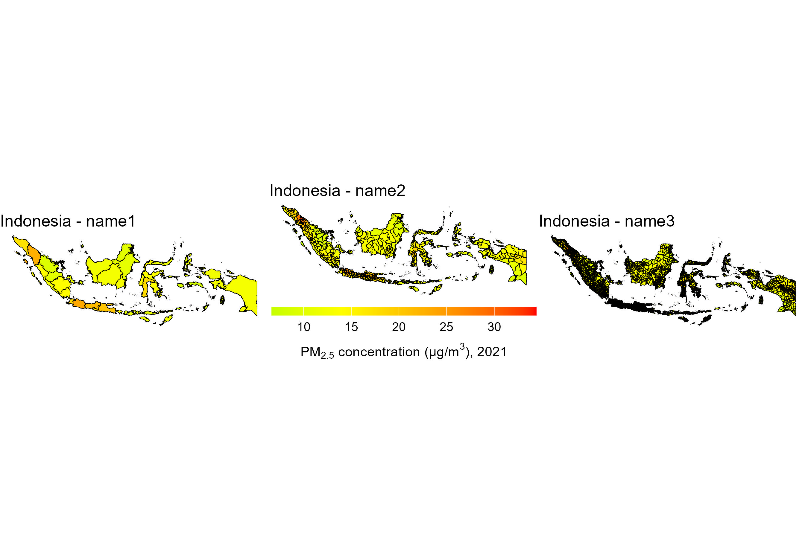
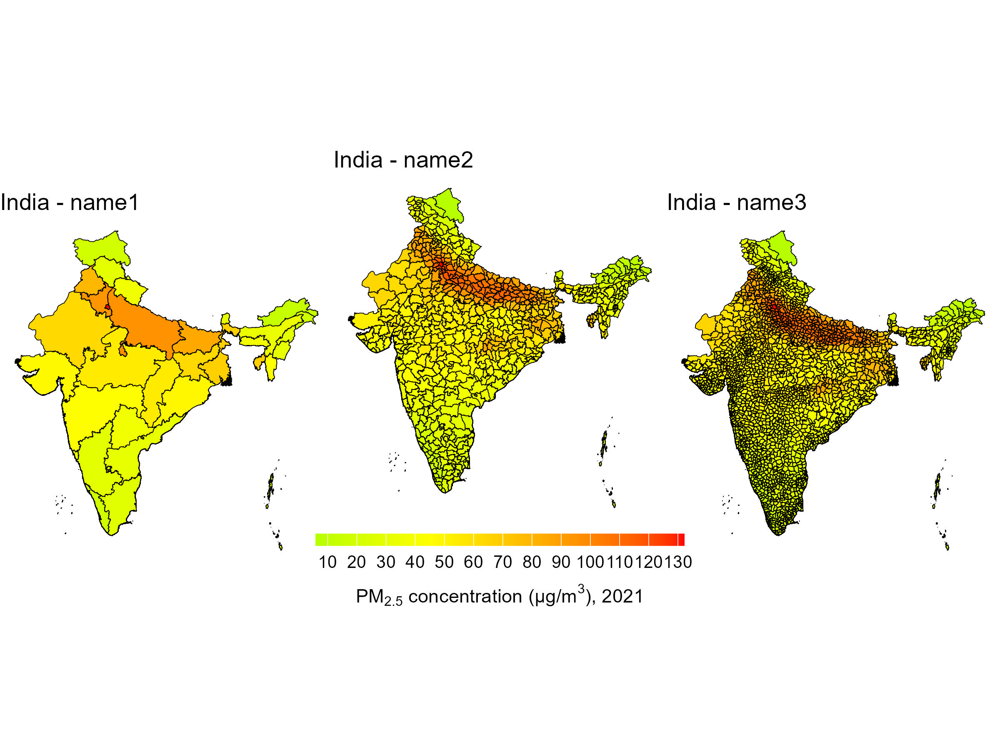
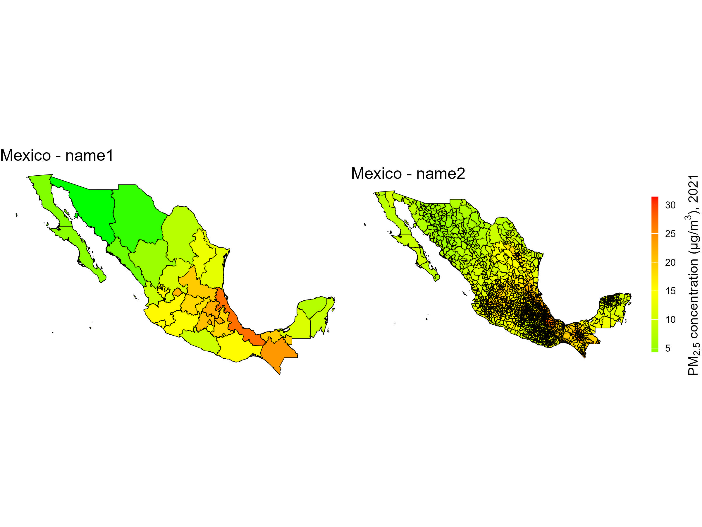
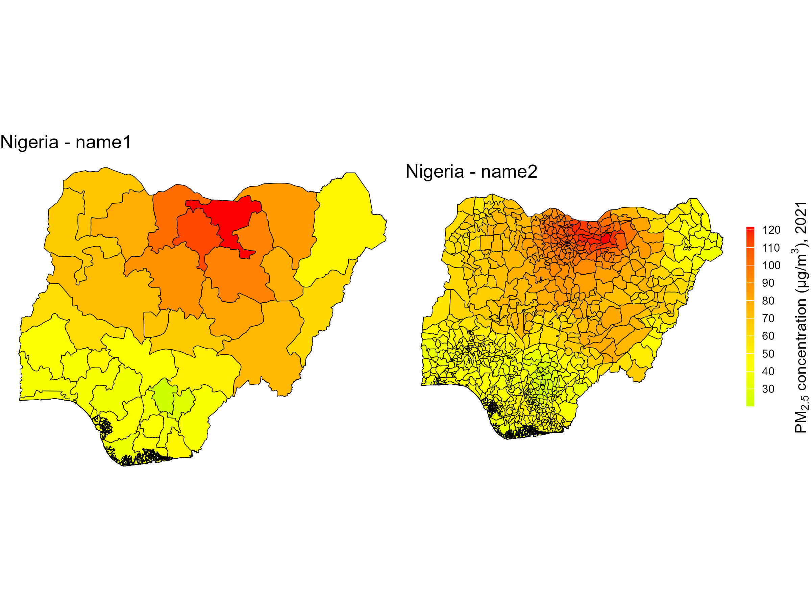
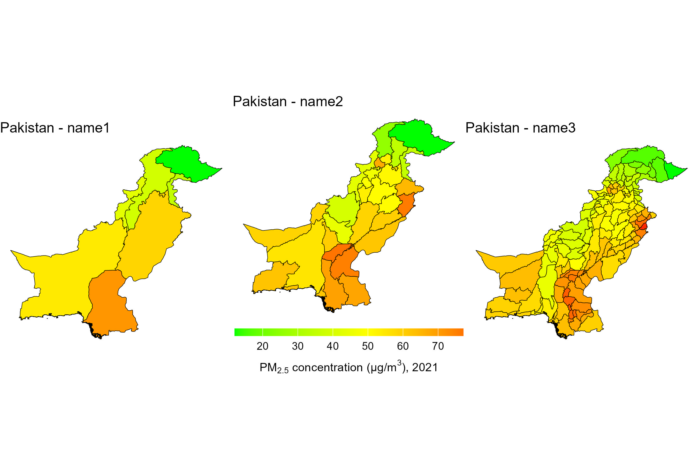
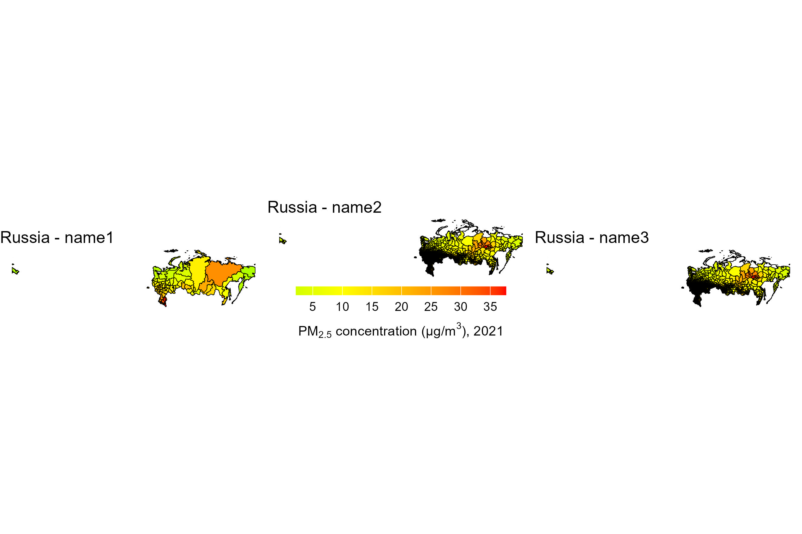
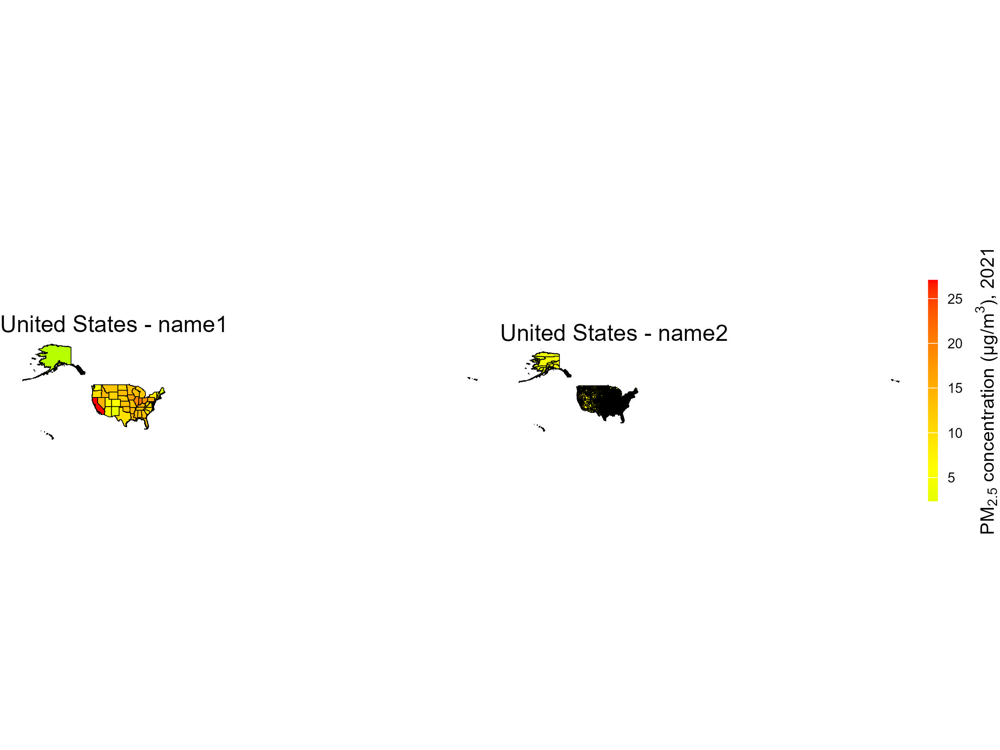

Population-weighted PM2.5 for countries
================
Lina Ang
2025-04-29

- [About](#about)
- [Data sources used](#data-sources-used)
- [Variables](#variables)
  - [Variables of interest](#variables-of-interest)
- [Bangladesh](#bangladesh)
- [Brazil](#brazil)
- [China](#china)
- [India](#india)
- [Indonesia](#indonesia)
- [Mexico](#mexico)
- [Nigeria](#nigeria)
- [Pakistan](#pakistan)
- [Russia](#russia)
- [United States](#united-states)
- [Contact](#contact)

## About

This repository contains yearly-average population-weighted
PM2.5 concentration levels for countries that was used for a
project and related publications on air quality knowledge (AQ-IQ) and
PM2.5 levels for the top 10 populous countries in the world. All data in
this public repository is free for use and download as they are
generated using open-source datasets. Pop-weighted yearly-average
PM2.5 concentration levels are available for the top 10
populous countries in the world: Bangladesh, Brazil, China, India,
Indonesia, Mexico, Nigeria, Pakistan, Russia, and United States for the
years 2019 to 2021.

## Data sources used

1.  The global annual PM2.5 concentration levels can be
    accessed from [Atmospheric Composition Analysis
    Group](https://sites.wustl.edu/acag/datasets/surface-pm2-5/#V5.GL.03).
2.  The maps files can be accesseed from
    [GADM](https://gadm.org/index.html).
3.  The global population distribution data can be accessed from
    [LandScan Global Population
    Database](https://www.eastview.com/resources/e-collections/landscan/).

## Variables

Example using highest spatial resolution (name3) for Bangladesh.

    ##  [1] "GID_3"     "GID_0"     "COUNTRY"   "GID_1"     "NAME_1"    "NL_NAME_1" "GID_2"     "NAME_2"    "NL_NAME_2"
    ## [10] "NAME_3"    "VARNAME_3" "NL_NAME_3" "TYPE_3"    "ENGTYPE_3" "CC_3"      "HASC_3"    "PM25_2019" "pop_2019" 
    ## [19] "pwpm_2019" "PM25_2020" "pop_2020"  "pwpm_2020" "PM25_2021" "pop_2021"  "pwpm_2021" "geometry"

### Variables of interest

1.  **NAME_X** = name of administrative unit for the associated
    PM2.5 concentration levels
2.  **PM25_XXXX** = raw annual average PM2.5 concentration
    levels for year XXXX
3.  **pop_XXXX** = population density for year XXXX
4.  **pwpm_XXXX** = population weighted average PM2.5
    concentration levels for year XXXX

## Bangladesh

<figure>

</figure>

## Brazil
<figure>

</figure>

## China
<figure>

</figure>

## India
<figure>

</figure>

## Indonesia
<figure>

</figure>

## Mexico
<figure>

</figure>

## Nigeria
<figure>

</figure>

## Pakistan
<figure>

</figure>

## Russia
<figure>

</figure>

## United States
<figure>

</figure>

## Contact

For more information, please email me at <ephanli@nus.edu.sg>.

